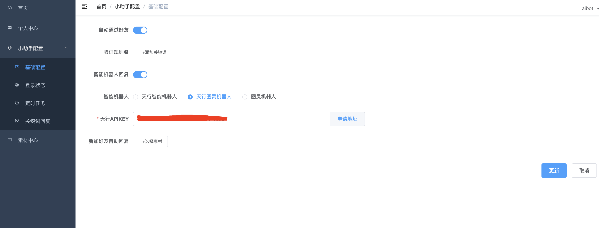
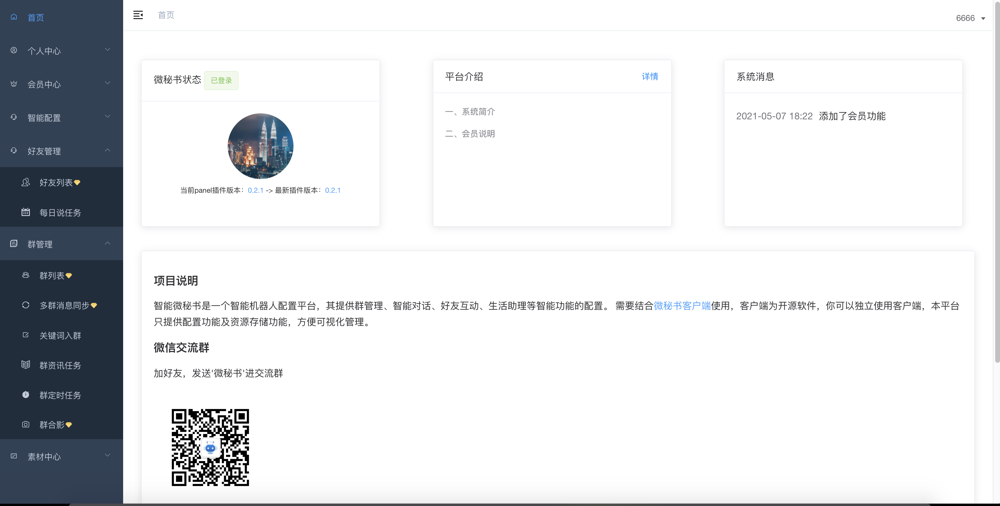
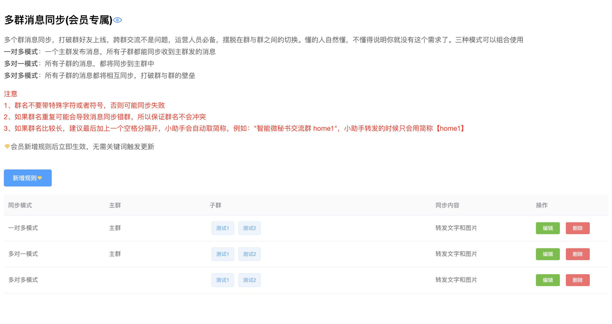
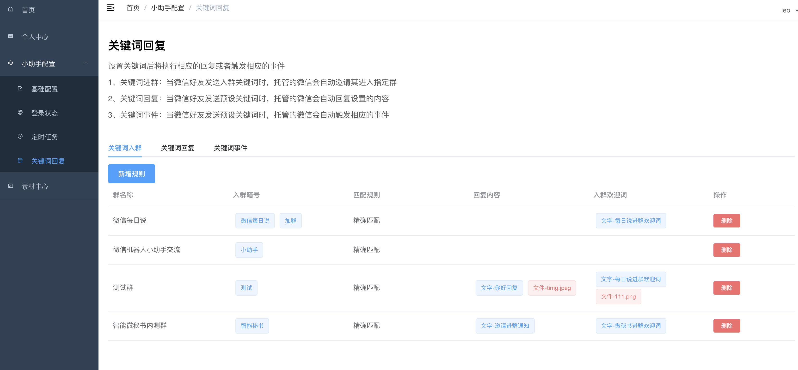
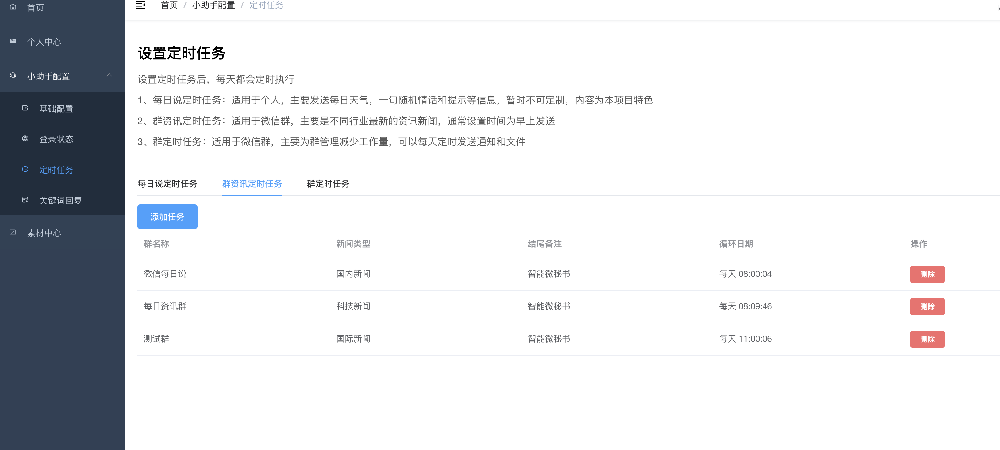
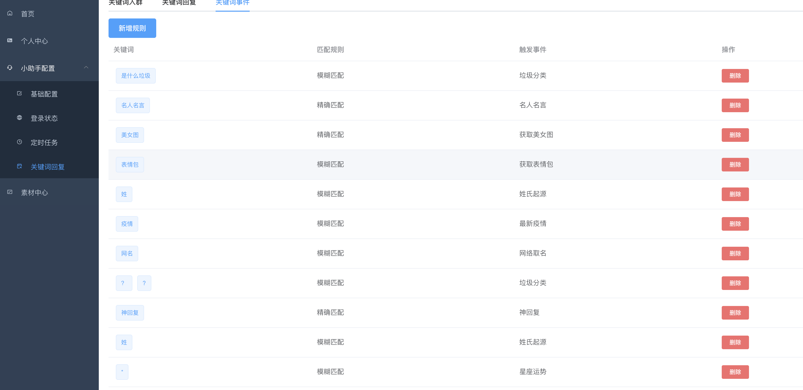
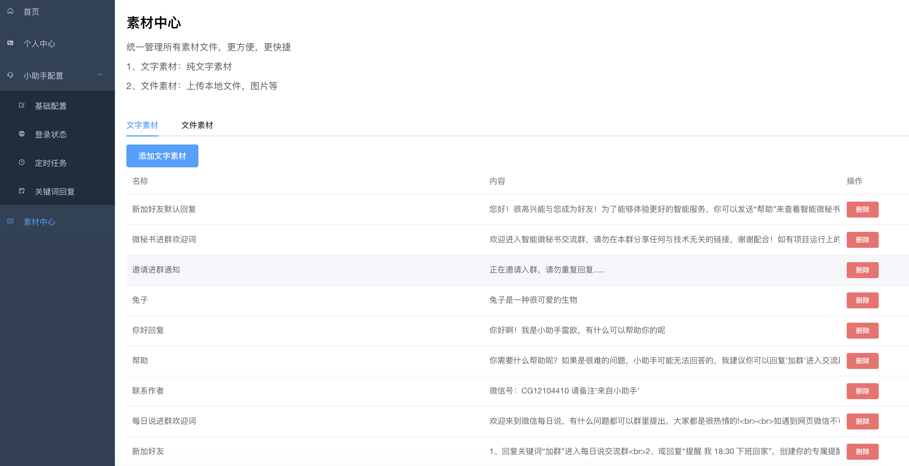
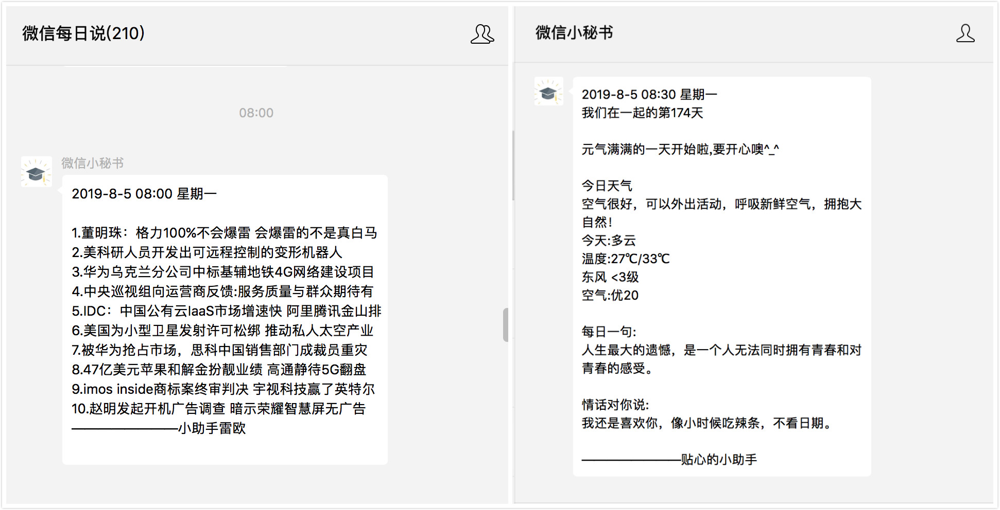
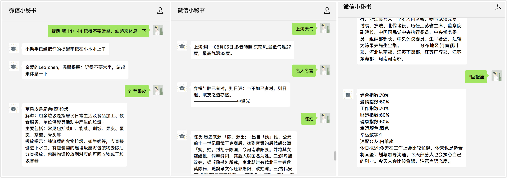
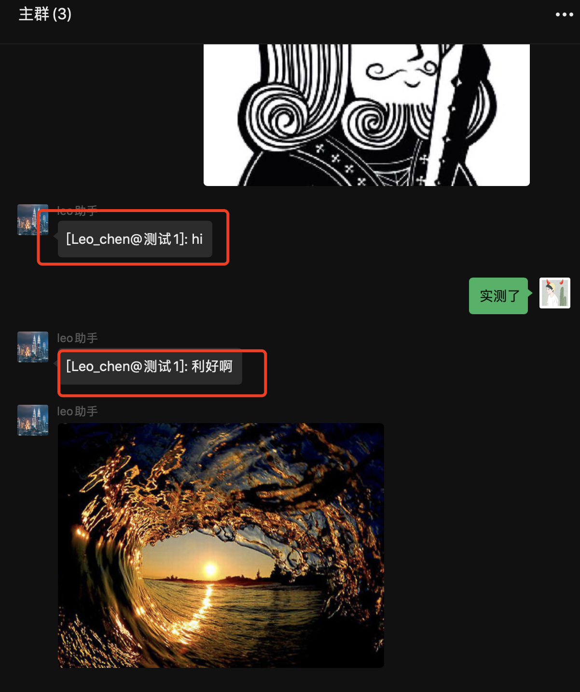

[](https://github.com/wechaty/wechaty)
[](http://nodejs.cn/download/)


[]()

## 智能微秘书-插件版-ipad协议

由于Wechaty ipad协议还未升级到1.x版本，所以单独维护了一个项目运行ipad协议，功能和与智能微秘书一样，功能说明参见[智能微秘书](https://github.com/leochen-g/wechat-assistant-pro)

## 环境依赖

node 版本 14.17.6 ，不要太高，太高安装依赖会有问题

## 提前准备

### ipad协议token申请

可以申请试用7天，[传送门](http://pad-local.com/#/)

### 注册智能微秘书管理账号

1. 注册：[智能微秘书](https://wechat.aibotk.com/#/signup)

2. 初始化配置文件`小助手配置->基础配置`，修改后保存

3. 个人中心获取`APIKEY`和`APISECRET`，后续配置用到



### 注册天行数据账号

由于本项目大部分定时资讯和一些天气接口来自于天行数据，所以需要提前准备好天行数据的账号，同时申请好相关接口的权限

1、注册: [天行数据](https://www.tianapi.com/source/865c0f3bfa)

2、申请接口权限

必选接口

* [天行机器人](https://www.tianapi.com/apiview/47)
* [天气](https://www.tianapi.com/apiview/72)
* [新闻](https://www.tianapi.com/apiview/51)
* [垃圾分类](https://www.tianapi.com/apiview/97)

可选接口（如果想使用相应的功能还是必须申请的），但是如果默认使用了天行机器人，以下功能接口无需申请也可以，机器人会直接返回对应信息

* [土味情话](https://www.tianapi.com/apiview/80)
* [名人名言](https://www.tianapi.com/apiview/92)
* [星座运势](https://www.tianapi.com/apiview/78)
* [姓氏起源](https://www.tianapi.com/apiview/94)
* [顺口溜](https://www.tianapi.com/apiview/54)
* [老黄历](https://www.tianapi.com/apiview/45)
* [神回复](https://www.tianapi.com/apiview/39)
* [歇后语](https://www.tianapi.com/apiview/38)
* [绕口令](https://www.tianapi.com/apiview/37)
* [疫情](https://www.tianapi.com/apiview/169)
* [网络取名](https://www.tianapi.com/apiview/36)

## 开始

### 直接运行

#### Step 1: 安装

克隆本项目，并进入项目根目录执行 `npm install`安装项目依赖

#### Step 2: 配置

`src/index.js`代码中配置`APIKEY`和`APISECRET`，还有购买的ipad协议token`padLocalToken`

#### Step 3: 运行

执行命令`npm run start`，终端会显示二维码，可以直接扫码，也可以到[智能微秘书](https://wechat.aibotk.com)（小助手配置->登录状态中进行扫码登录）

#### Step 4: 配置相应功能

在[智能微秘书](https://wechat.aibotk.com)中配置你需要的功能后，给启动的微信发送`更新`关键词即可拉取最新配置（或者你自己设置的更新关键词，初始关键词是`更新`，**
每次修改配置后，请记得一定发送关键词更新配置**

### 直接拉取镜像（推荐）

由于自己构建部分依赖安装比较慢，或者经常会卡住，所以本项目已经提前构建好发布到dockerhub了，直接pull就行了

#### step1： 拉取镜像

```shell

docker pull aibotk/wechat-assistant-ipad

```

#### step2： 启动docker

以下两个命令自己选择一个执行就行

1、请在项目根目录执行，这个命令是前台执行可以直接看到log日志的，但是没法关闭，只能销毁终端实例

```shell
docker run -e PAD_LOCAL_TOKEN="你申请的ipdalocaltoken" -e AIBOTK_KEY="微秘书apikey" -e AIBOTK_SECRET="微秘书apiSecret" --name=wechatbot aibotk/wechat-assistant-ipad

```

2、这个命令可以在后台运行，多了一个`-d`

```shell
docker run -d -e PAD_LOCAL_TOKEN="你申请的ipdalocaltoken" -e AIBOTK_KEY="微秘书apikey" -e AIBOTK_SECRET="微秘书apiSecret" --name=wechatbot aibotk/wechat-assistant-ipad

```


[如何查看docker日志](https://www.cnblogs.com/mydesky2012/p/11430394.html)

### 自行构建docker镜像 （不建议）

需要提前安装 docker 环境，项目根目录执行一下命令

```shell script
docker build -t wechat-assistant-ipad .

docker run -e PAD_LOCAL_TOKEN="你申请的ipdalocaltoken" -e AIBOTK_KEY="微秘书apikey" -e AIBOTK_SECRET="微秘书apiSecret" wechat-assistant-ipad 

```

其他步骤同上

## 体验与交流

扫描下方二维码，添加智能微秘书，体验以上所有功能，发送加群关键词即可进入交流群


## 捐助

如果您认为这个项目对你有所帮助，可以扫描以下二维码进行捐助，

不管钱多钱少，您的捐助将会激励我持续开发新的功能！🎉

感谢您的支持！

捐助方法如下：

<div style="display: flex;justify-content: flex-start">


</div>

## 更新日志

[更新日志](./CHANGELOG.md)

## 常见问题处理

参见[https://www.xkboke.com/web-inn/wechatBot/#%E5%B8%B8%E8%A7%81%E9%97%AE%E9%A2%98%E5%A4%84%E7%90%86](https://www.xkboke.com/web-inn/wechatBot/#%E5%B8%B8%E8%A7%81%E9%97%AE%E9%A2%98%E5%A4%84%E7%90%86)

## 面板预览








## 功能预览



个人定时与群定时任务



群消息同步



群合影


## 免责声明

本软件依据github上开源项目 Wechaty

通过简单的设置UI和交互，运行微信机器人。

请遵守国家法律政策，请勿用于非法犯罪行为！

请合理使用，一切不良行为和后果均与作者无关！
